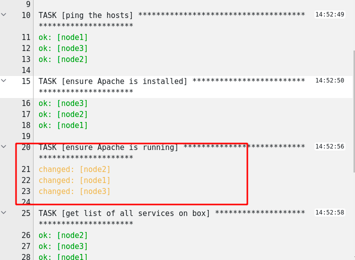

Creating a Job Template
=======================
A job template is a definition and set of parameters for running an
Ansible job. Job templates are useful to execute the same job many
times.

Step 1:
-------

Select **Templates**

 

Step 2:
-------

Click the  icon, and select Job Template

Step 3:
-------

Complete the form using the following values

| Key         |Value                                   | Prompt on Launch |
|-------------|----------------------------------------|------------------|
| Name        | Playbook-Demo              |                  |
| Description | Demo Job Template |                  |
| JOB TYPE    | Check                                    | Ticked          |
| INVENTORY   | Workshop Inventory                      |                  |
| PROJECT     | Workshop Project               |                  |
| PLAYBOOK    | `playbooks/playbook-demo.yml`                   |                  |
| CREDENTIAL  | Student Account                        |                  |
| LIMIT       | web                                       | Checked          |


Step 4:
-------

Click SAVE  


Running a Job Template
======================

Now that you’ve successfully created your Job Template, you are ready to
launch it. Once you do, you will be prompted on what we asked it to prompt on launch.


We want to keep this to Check for now but its worth noting in the playbook we set

```
hosts: web
```
We can set the limit to just an individual box etc like node1 if we want to.

Click on Next

This gives us a preview of any changes we made and then click on Launch


Step 3:
-------

Sit back, watch the magic happen

One of the first things you will notice is the summary section. This
gives you details about your job such as who launched it, what playbook
it’s running, what the status is, i.e. pending, running, or complete.


Next you will be able to see details on the play and each task in the
playbook.



We see that there is a change on the Apache service, this is because when we ran our adhoc command we didnt set the service to start on reboot with the ```enable: true``` flag

Step 4:
-------

Lets run the job template again but allow it to make changes.

Select **Templates**

 

You will now see the Template we created and we can launch it from here by selecting the  icon

Change the Job Type to Run


Click Next and then Launch
This will now execute but make the changes where needed.

Finally rerun the job template again in Check mode to see we are now in our desired state and no changed would be made.

End Result
==========

You should now be familiar with how to run a Job Template in a check only mode to see if you are in your desired state as well as run it to make changes if needed. As well as how we can limit the run against a single machine or groups.
