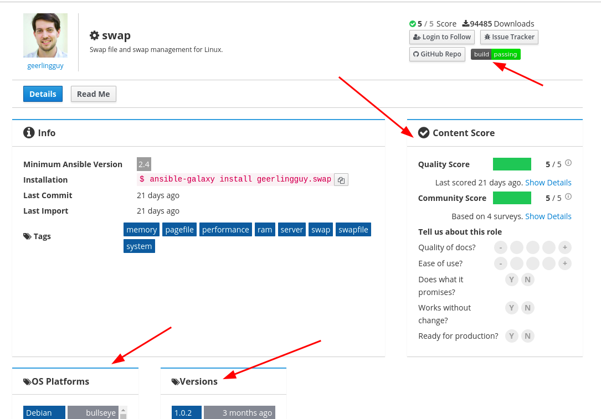
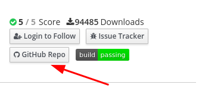
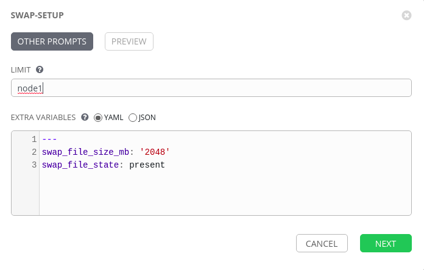
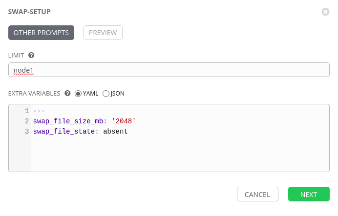

Although it is possible to have all of our tasks inside a single playbook as we saw from the previous exercise. As we progress on our automation journey and branch out across the different enterprise teams, we will start to see a our playbooks will become very large, not only does this increase the complexity to make troubleshooting harder but it also inhibits the ability to have collaboration on the Ansible playbook by multiple users /teams at the same time.

Ansible Roles allow us to split up a playbook into many files to make it easier to create and debug but also easier for others to reuse your work. 

We are going to review and include a role.

To run a Security scan on our machines we require 2GB of ram, However; Our lab machines have less that 1GB to fix this we can setup swap memory. 

Lets say we have more than 1 distro in our enterprise ( RHEL, SUSE, Ubuntu etc) I wouldnt want to have to create multiple playbooks to setup swap for each distro same as I wouldnt want to have to have a single playbook files with a load of when conditions, as I potentially have different SMEs that would write based on the OS / Application.

Ansible Galaxy has a trove of pre written playbooks and roles and rather than re-invent the wheel, I have decided to include one from Galaxy for this. 

Section 1: Review the swap role
=======================================================

Step 1:
-------

The Swap role we are going to use can be found here on Galaxy
https://galaxy.ansible.com/geerlingguy/swap

The role documentation shows that it will work on various versions of Debian, EL and Ubuntu which can be round under the OS Platforms.

We can also see the version history to see that it is still being maintained.

We also see a content score which is based on Ansible testing as well as community feedback.

Finally at the top right we can see a current build status that Travis CI reports on when updated.




Step 2:
-------

At the top right of the Galaxy role there is a link to the repo which will take us straight to the source code.



or click on this link
https://github.com/geerlingguy/ansible-role-swap


Step 3:
---

When calling a role Ansible first executes the main.yml file in the tasks directory.

Within the tasks directory we can see 3 playbooks ( main, enable and disable )

The main.yml shows us the logic with 3 simple tasks.

```
---
- name: Manage swap file entry in fstab.
  mount:
    name: none
    src: "{{ swap_file_path }}"
    fstype: swap
    opts: sw
    state: "{{ swap_file_state }}"

- include_tasks: disable.yml
  when: swap_file_state == 'absent'

- include_tasks: enable.yml
  when: swap_file_state == 'present'
```
First to ensure the mount point either exists or does not exist in the fstab file.

Next the include_tasks module is used to read in another playbook depending on the condition.

We can now see how we can break down the playbooks into bite size code than ending up with a large playbook based on conditions.

Step 4:
---
Going back to the root of the repo we should look at the defaults folder, and again the main.yml will be read automatically, this variable file is the bottom of the hieracy and should be used for documentation purposes of any variable used within your role. 

We can see the following variables can be used with this role.

```
---
swap_file_path: /swapfile
swap_file_size_mb: '512'
swap_swappiness: '60'
swap_file_state: present
swap_file_create_command: "dd if=/dev/zero of={{ swap_file_path }} bs=1M count={{ swap_file_size_mb }}"

swap_test_mode: false
```

We can override any of these variabled using the vars ( group and host variables )
The highest level of order is set on extra vars of which resides in the Tower Job Template form.

Step 5:
---

To use a role from galaxy we need to tell Tower to use it, this can be done with a requirements.yml file this needs to reside in the roles folder on your SCM.

I have this swap added in for us by simply adding this into my requirements.yml file.

```
---
- src: geerlingguy.swap
```

Step 6:
---

We can also see from the swap role documentation to simply use this role on its own, we would need to create a playbook like so.

```
- hosts: all

  vars:
    swap_file_size_mb: '1024'

  roles:
    - geerlingguy.swap
```

Note how tasks has been changed to roles.


Create Job Templates for Swap memory in Tower.
===

Step 1:
---
Back in Tower resync the project

To do this, click
**Projects** and then click the sync icon next to your project. Once
this is complete, you can create the job template.


Creating a Job Template
=======================

Step 1:
-------

Select **Templates**

Step 2:
-------

Click the  icon, and select Job Template

Step 3:
-------

Complete the form using the following values

| Key         |Value                                   | Prompt on Launch |
|-------------|----------------------------------------|------------------|
| Name        |swap-setup|                  |
| Description |Template for configuring swap memory|                  |
| JOB TYPE    |Run                                    |                  |
| INVENTORY   |Workshop Inventory                      |                  |
| PROJECT     |Workshop Project               |                  |
| PLAYBOOK    |`playbooks/swap_setup.yml`                   |                  |
| CREDENTIAL  |Student Account                        |                  |
| LIMIT       |                                        | Checked          |
| OPTIONS     |         |                  |
| EXTRA VARIABLES|---<br>swap_file_mb: '2048'<br>swap_file_state: present| Checked
Step 4:
-------

Click SAVE  

Run The Job Template
======================

Step 1:
---
When you launch the job template it will prompt you the limit


Change limit to node1

and click next

and then click launch

You will now see this setup a 2GB swap file on node1 with the full output

Step 2:
---
Lets go back and relaunch the Template but this time remove it by changing the swap_file_state to ***absent***



End Result
==========

We can now see how roles can make code easier to manage allow multiple people to work on the same project by delegating individal yaml files for tasks, and we saw the ease of reuse by overriding with the variables.