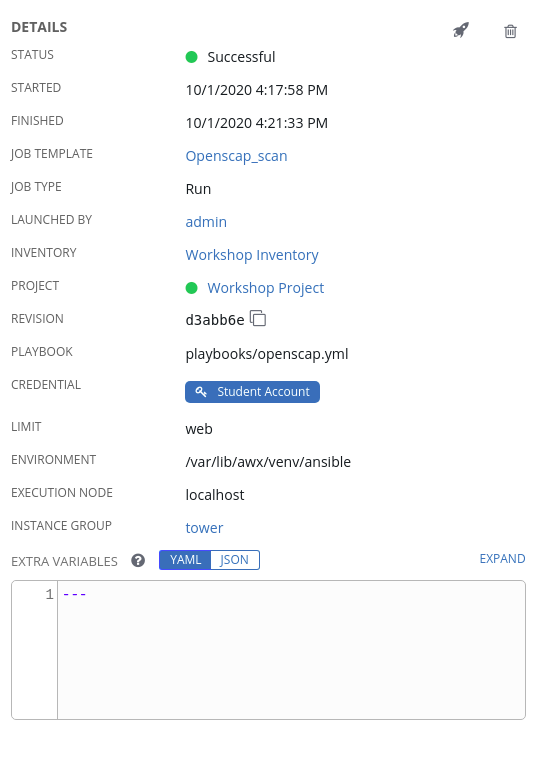
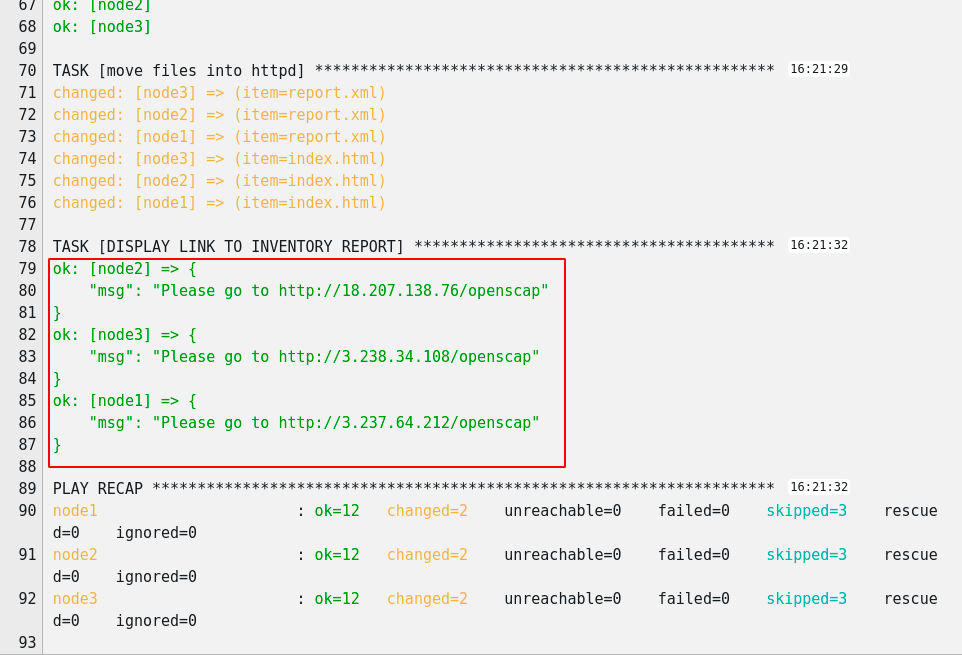
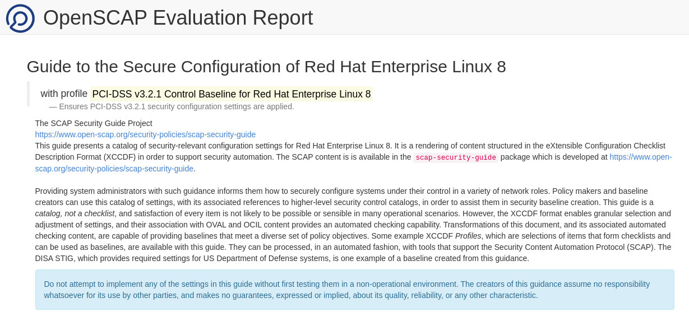
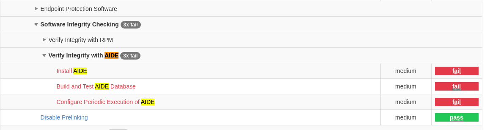

Creating a Job Template
=======================
A job template is a definition and set of parameters for running an
Ansible job. Job templates are useful to execute the same job many
times.

Step 1:
-------

Select **Templates**

Step 2:
-------

Click the  icon, and select Job Template

Step 3:
-------

Complete the form using the following values

| Key         |Value                                   | Prompt on Launch |
|-------------|----------------------------------------|------------------|
| Name        | Openscap_scan              |                  |
| Description | Template To setup and run the OpenSCAP scan |                  |
| JOB TYPE    | Run                                    |                  |
| INVENTORY   | Workshop Inventory                      |                  |
| PROJECT     | Workshop Project               |                  |
| PLAYBOOK    | `playbooks/openscap.yml`                   |                  |
| CREDENTIAL  | Student Account                        |                  |
| LIMIT       | web                                       | Checked          |
| OPTIONS     | [*] ENABLE PRIVILEGE ESCALATION        |                  |

Step 4:
-------

Click SAVE  

Running a Job Template
======================

Now that you’ve successfully created your Job Template, you are ready to
launch it. Once you do, you will be redirected to a job screen which is
refreshing in real time showing you the status of the job.

Step 1:
-------

Select TEMPLATES

> **Note**
>
> Alternatively, if you haven’t navigated away from the job templates
> creation page, you can scroll down to see all existing job templates

Step 2:
-------

Click the rocketship icon  for the
**Openscap_scan**

Step 3:
-------

Sit back, watch the magic happen

One of the first things you will notice is the summary section. This
gives you details about your job such as who launched it, what playbook
it’s running, what the status is, i.e. pending, running, or complete.

Next you will be able to see details on the play and each task in the
playbook.

Step 4:
-------

When the job has successfully completed, you should see a URL to your website printed at the bottom of the job output.

If all went well, you should see something like this, but with your own
custom message of course.

Now navigate to any of the node urls http://node_ip/openscap and you should will see the full report of the systems scap compliance status
.

If we scroll down or search you will find the Verify Integrity with AIDE has 3x failures 

If we click on the one marked install AIDE, it will give us information about the control point and also give us the commands to resolve it as well as show us the ansible code needed for this control point.

Step 5
-------
Create the job template for the remediation playbook for aide

Select **Templates**

Click the  icon, and select Job Template

Complete the form using the following values

| Key         |Value                                   | Prompt on Launch |
|-------------|----------------------------------------|------------------|
| Name        | aide_remediation             |                  |
| Description | Template To setup and run the OpenSCAP scan |                  |
| JOB TYPE    | Run                                    |                  |
| INVENTORY   | Workshop Inventory                      |                  |
| PROJECT     | Workshop Project               |                  |
| PLAYBOOK    | `playbooks/aide-remediation.yml`                   |                  |
| CREDENTIAL  | Student Account                        |                  |
| LIMIT       | web                                       | Checked          |
| OPTIONS     | [*] ENABLE PRIVILEGE ESCALATION        |                  |

Click SAVE  

Now launch the aide_remediation playbook and then rerun the Openscap_scan job template to confirm you have fixed this issue.

End Result
==========

Did you notice during the 2nd run of the Openscap job less tasks had a change value in them, this is due to Ansible being idempotent and only making changes if youre desired state it not already in place.
