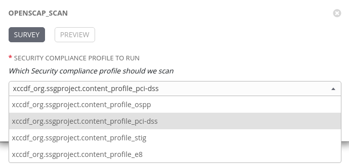
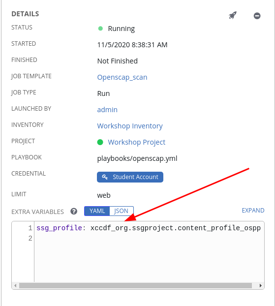
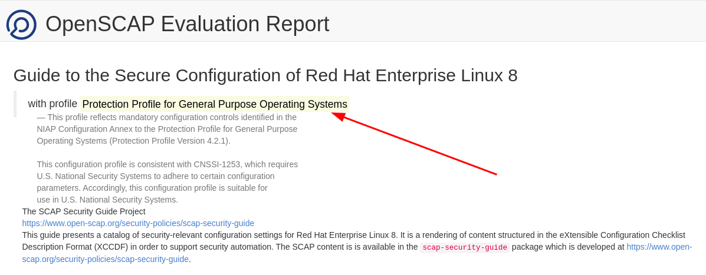

Adding a Survey
=======================
A survey allows us to change the job template behaviour by changing the variable answers in a human readable form.

Step 1:
-------

Select **Templates**

Step 2:
-------

Click our Openscap_scan job template and then click on the  icon.

Step 3:
-------
Complete the survey form with following values

| Key                     | Value                                                                                                                                                  | Note                                         |
|-------------------------|--------------------------------------------------------------------------------------------------------------------------------------------------------|----------------------------------------------|
| PROMPT                  | Security Compliance Profile to Run                                                                                                                                             |                                              |
| DESCRIPTION             | Which Security compliance profile should we scan for?                                                                                                                           |                                              |
| ANSWER VARIABLE NAME    | ssg_profile                                                                                                                                             |                                              |
| ANSWER TYPE             | Multiple Choice (single select)                                                                                                                      | **There's also a *single* selection option** |
| MULTIPLE CHOICE OPTIONS |  xccdf_org.ssgproject.content_profile_ospp xccdf_org.ssgproject.content_profile_pci-dss xccdf_org.ssgproject.content_profile_stig xccdf_org.ssgproject.content_profile_e8 |                                              |
| DEFAULT ANSWER          |  xccdf_org.ssgproject.content_profile_pci-dss                                                                                                                       |                                              |
| REQUIRED                | Selected                                                                                                                                               |                                              |
|                         |                                                                                                                                                        |                                              |

Once complete, click the ADD  button.

Then click the Save  button.

Step 4
-------

Launch the Job Template and you will be prompted with the question and multiple choice answers

Select a survey and then click next to launch.

Step 5
-------
Notice in the job run window that we are logging any customization set

Step 6
-------
Navigate to the url of the openscap report notice how we have now got a different report.

End Result
==========

You should now see how easy we can have a single job template to be used against different scenarios by simply creating a survey and asking the end user a human readable question.