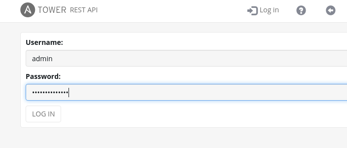

Using Ansible Towers API
=======================
To be able to scale out our automation we will want to be able to trigger launching of jobs from other tools.

Opening up the Tower API URL
=========================
The Ansible Tower API has a full browsable url, open up another browser tab and enter into the address bar your towr URL with '/api/v2'

Step 1:
-------
Ensure you are logged in if you had been in the UI then the API will stay logged in with your session and you will see it as such

If you are not logged in then you will see the following

If you are not logged in simply click on the Login box and then authenticate with your admin and password credentials.

Step 2:
-------
The API is fully browsable, we will go ahead and launch a job template click on the link for "job_templates"

Step 3:
-------

Search for Openscap

Scroll up ans click on the URL

*Note this job id number can be found from the UI when you click into the job template the browser address bar has the job_ID

You can also use the name for the API call

So where we now have
https://YOUR_TOWER_UI/api/v2/job_templates/JOB_ID_NUMBER/

This can also be used like this

https://YOUR_TOWER_UI/api/v2/job_templates/Openscap_scan/

Just ensure you dont use spaces when creating job templates to make this easier.

Step 4:
-------
Scroll down to the bottom of the page and you will see all the options we could use to configure this job template over the API

This tells us that our Media type for the API is application/json
what we can have in the body to change it in key/value pairs and the type of method to use PUT or PATCH.

Step 5:
-------
Click on the launch link for the job template

Again we can get all the information needed for an api call here the URL, the MEDIA type, and the BODY content as well as the METHOD type in this case a POST to launch it.

Step 6:
-------
When using an API to launch job templates we will want to be able to customize the launch of the job, for anything we need to custom we must have a prompt on launch tick enabled, this can be done in the UI or the API, lets set the Limit flag so we can execute this just on a single node of our choice.

Option 1 - UI METHOD

You can browse the job template in the UI and select Prompt on launch and save the job template.

Option 2 - API METHOD

On the API job template page ( remove the /launch/ from your address bar ) Navigate to the bottom and in the options change ask_limit_on_launch to true and click on PATCH

Step 7:
-------
Naviagate back to the launch page and you will now see that the limit option can now be controlled via the API.

Change the limit to 

`node1`

Set the ssg_profile to 

`xccdf_org.ssgproject.content_profile_pci-dss`

and click on POST

this will launch the job on node1 only and use the default Openscap policy ( PCI )

Naviagate back to the job view in the Tower UI and you can see it launch with the options

